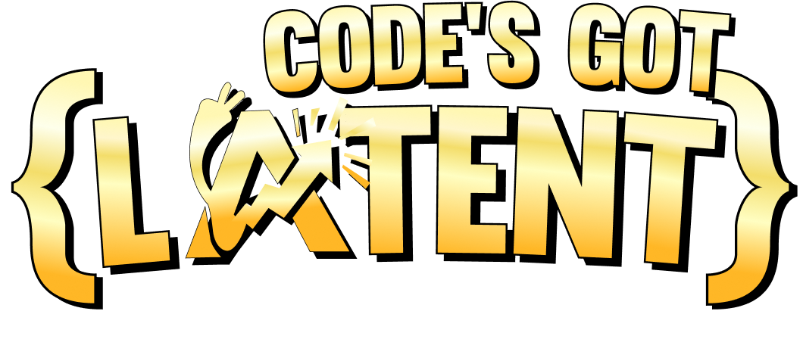
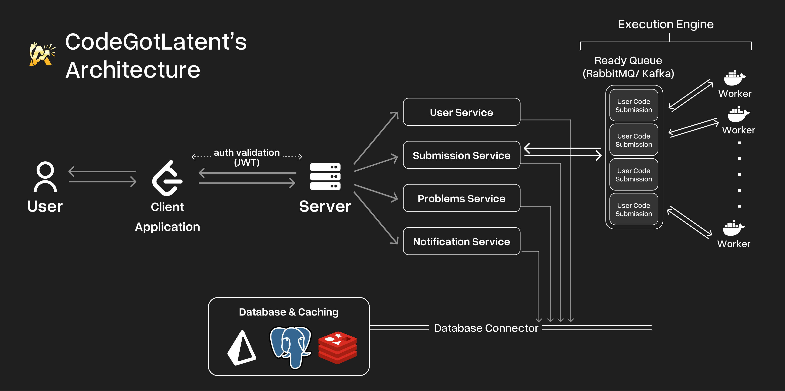

# 🚀 CodeGotLatent – Where Code Meets Competition

***A parody of India's Got Talent – but for coders!***

Welcome to **CodeGotLatent**, a competitive programming platform that merges *skill*, *intuition*, and *fun*. Contestants solve curated coding challenges and then **guess their rank** based on performance. If the guess is close, their **rating spikes**. If not... better luck next time!

---

## 🎯 Why CodeGotLatent?

> *"You don't just solve problems. You *predict* your success."*

### 🧠 Our Unique Selling Proposition (USP)

* 🔮 **Guess & Gain**: Match your guess with the actual rank to **earn extra points**. Misjudge? Face the consequences.
* 🎮 **Gamified Ratings**: Coding + Prediction = New Era of Competition.
* 🔍 **Intuition Matters**: This isn't just about code—it's about knowing your worth.

---

## 🏗️ System Architecture

---

## 💻 Tech Stack

### Frontend:

* **React.js**
* **Tailwind CSS**
* **Zustand** (for state management)

### Backend:

* **Express.js**
* **JWT Auth** + **Google OAuth**
* **Judge0 Self-Hosted API** (for code execution)
* **Rating Logic** (custom Elo + Guess-Based Modifier)

### Database:

* **PostgreSQL** with **Prisma ORM**
* **Redis** (for Rate Limiting)
* **GCP Bucket** (for file storage)

---

## 🧩 Key Features

| Feature                | Description                                                        |
| ---------------------- | ------------------------------------------------------------------ |
| 🎯 Rank Guessing       | Predict your rank after submitting. Closer = Higher rating jump!   |
| 🧠 Rating System       | Elo-inspired with modifiers for accuracy in self-assessment        |
| ✍️ Live Contests       | Participate in weekly contests with hidden leaderboards            |
| 🧪 Judge0 Integration  | Reliable, fast code execution for multiple languages               |
| 🗃️ Submission History | Revisit your code, edit past 5 operations, and learn from mistakes |
| 🏆 Leaderboard         | Sorted by intuition, consistency, and coding skill                 |
| 📈 Profile Dashboard   | Track rating, guess accuracy, problem stats, and streaks           |

---

## 🙌 Made With Love

This project was built by passionate developers who wanted to turn coding contests into an addictive, gamified journey.
Let’s make coding *fun* again.

Join us in this adventure and help shape the future of competitive programming!
Follow us on [GitHub](https://github.com/HitG010/codegotlatent) and leave a star if you like what you see! ⭐

Github handles of developers:
- **Hitesh Gupta** – [GitHub](https://github.com/hitg010)
- **Kartik Bindra** – [GitHub](https://github.com/kartikbindra)

---

## 🌐 Live Demo

> *Show your Latent now at [codegotlatent.com](https://codegotlatent.com)*

---

## 📫 Contact

Got ideas, feedback, or want to collaborate?

**Hitesh Gupta** – [LinkedIn](https://linkedin.com/in/hiteshgupta201105) • [Email](mailto:guptahitesh201105@gmail.com)
**Kartik Bindra** – [LinkedIn](https://linkedin.com/in/kartikbindra) • [Email](mailto:bindrakartik64@gmail.com)
